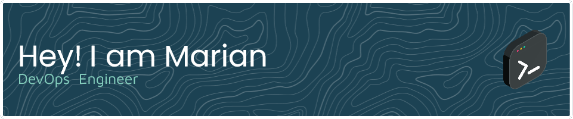

<h2 align="left"> 👀 </h2>

###

###

<h3 align="left">🛠 Language and tools</h3>

###

  
  
  
  
  
  
  
  
  
  
  
  
  
  
  
  
  
  
  
  
  
  
  
  
  
  
  
  
  
  
  
  
  
  
  
  
  
  
  

###

<h3 align="left">👩‍💻  Where to find me</h3>

###

  <a href="https://www.linkedin.com/in/mocanu-marian" target="_blank">
  <a href="https://tryhackme.com/p/viralnico" target="_blank">
  <a href="https://twitter.com/ismarianm" target="_blank">

###

<h3 align="left">🔥  Stats :</h3>

###

  
  

###

